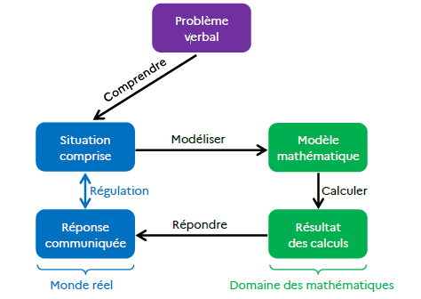

# Formation — Résolution de problèmes (Cycles 2 & 3) — 180 minutes

Public: Enseignants cycles 2 et 3
Thème: Créer et mener une séance explicite de résolution de problèmes (focus C2 additifs, ouvertures C3)

## Objectifs généraux
- Concevoir une séance structurée (modelage → guidage → autonomie → mise en commun → institutionnalisation)
- Installer des démarches explicites de résolution (lire→représenter→résoudre→vérifier)
- Intégrer différenciation et accessibilité (incl. malvoyants)
- Aligner les pratiques aux programmes 2025 et documents d’accompagnement

## Prérequis et supports
- Prérequis: connaissance de base du programme; envie de mutualiser des pratiques
- Supports fournis:
  - Séance modèle C2, cheat sheet A4, grille 0–3 (évaluation formative)
  - Exemples CM1/CM2, outils de représentation (barres, tableaux)
  - Polycopié (ce document), slides MARP

---

## Déroulé détaillé (180 minutes)

### 1) Ouverture et cadrage (10’)
- Contenu & activités:
  - Mise en route: attentes de la séance, critères de réussite (visibles)
  - Rappel ciblé des programmes 2025 (rôle central des problèmes)
  - Mini-lexique de base (indices: gagne/perd, de plus/de moins, reste)
- Supports: slides d’ouverture; aperçu cheat sheet
- Évaluation/Feedback: vérification rapide de compréhension (questions flash)

### 2) Analyse des représentations (30’)
- Objectifs: partir du réel; identifier malentendus récurrents
- Activités:
  - Retour sur questionnaire pré-séance (tendances de la cohorte)
  - Brainstorming guidé: « qu’est-ce qu’un problème ? » « comment le résoudre ? »

- Supports: synthèse dépouillement; tableau collaboratif (mots-clés)
- Différenciation/Accessibilité: alternance oral/écrit; verbalisation guidée
- Évaluation/Feedback: recueil des idées; mise au jour des biais fréquents

### 3) Enseignement explicite — trame (15’)
- Objectifs: comprendre et adopter la trame M→G→A→MC→I
- Contenus: modelage (penser à voix haute), étayage (questions), autonomie graduée, institutionnalisation
- Activités:
  - Mini-démonstration: l’enseignant modélise une micro-tâche
  - Décryptage collectif des étapes et des critères observables
- Supports: slide « trame », gabarit de séance
- Différenciation/Accessibilité: exemples concrets; checklist
- Évaluation/Feedback: questions-réponses ciblées, critères partagés

### 4) Séance modèle — C2 problèmes additifs (35’)
- Objectifs: identifier structure, choisir une stratégie, expliciter le raisonnement
- Contenus (très concret):
  - Énoncé type (transformation) + variantes (combinaison, comparaison)
  - Schémas en barres; phrase-réponse; contrôle de vraisemblance
- Activités (déroulé serré):
  - Modelage enseignant (lecture→indices→schéma→calcul→vérification)
  - Pratique guidée (1 énoncé analogue; questions étayantes)
  - Autonomie (2 énoncés gradués; justification courte)
  - Mise en commun: 2 démarches comparées; invariants
- Supports: fiche séance modèle; banque d’énoncés; schémas canoniques
- Différenciation/Accessibilité: nombres ajustés; schémas pré-tracés; police lisible; contrastes
- Évaluation/Feedback: observation critériée (grille 0–3)

### Pause (10’)
- Pause logistique et respiration (eau, déplacement). Reprise annoncée à l’avance.

### 5) Atelier 1 — Conception (50’)
- Objectifs: concevoir une séance complète alignée (objectifs→déroulé→supports→critères)
- Activités:
  - Par binômes: choix d’un thème (additif C2 ou pont vers C3), rédaction avec gabarit
  - Préparation de variantes (différenciation) et preuves d’accessibilité
- Supports: gabarit de préparation; banque de schémas/énoncés; cheat sheet A4
- Différenciation/Accessibilité: accompagnement sur la formulation d’objectifs observables
- Évaluation/Feedback: revue « stop-check » du formateur pendant la conception

### 6) Atelier 2 — Feedback croisé + grille (30’)
- Objectifs: appliquer une grille 0–3; formuler un feedback utile (processus)
- Activités:
  - Pairs review: échange de préparations; grille 0–3 par critère
  - Rédaction d’un feedback structuré (synthèse, points forts, axes, 3 priorités)
- Supports: `modules/lot1/qcm/qcm_v1.md` (grille), modèle de feedback
- Différenciation/Accessibilité: discussion guidée; exemples de formulations constructives
- Évaluation/Feedback: double regard (pairs + formateur)

### 7) Synthèse et ressources (15’)
- Objectifs: stabiliser les invariants, planifier le transfert en classe
- Activités:
  - « À retenir »: démarches, structures, représentations, critères
  - Roadmap post-séance: dépôt en ligne; feedback IA (Alia); entraînements ciblés
- Supports: cheat sheet A4; polycopié; liens vers ressources
- Évaluation/Feedback: auto-positionnement final; questions de clôture

---

## Annexes pédagogiques
- Checklist (cheat sheet): `modules/lot1/cheat_sheet_A4.md`
- Grille 0–3 (évaluation formative): `modules/lot1/qcm/qcm_v1.md`
- Séance modèle C2: `modules/lot1/seance_modele.md`
- Exemples CM1/CM2 (séquences):
  - `docs/sources/documentation_interne/exemples_mise_en_oeuvre_cm1_maths.md`
  - `docs/sources/documentation_interne/exemples_mise_en_oeuvre_cm2_maths.md`

## Références internes (sélection)
- Cadre et progression C3: `docs/sources/documentation_interne/programmes_cycle_3_2023.md`
- Résolution de problèmes (v2): `docs/sources/documentation_interne/la_resolution_de_problemes_v2.md`
- Guide CP 2021: `docs/sources/documentation_interne/guide_mathematiques_cp_2021.md`
- Annexes ENS EL 135/620: `docs/sources/documentation_interne/annexe_ensel135_annexe4.md`, `annexe_ensel620_annexe2_v2.md`
- RA25 CP (annexes): `docs/sources/documentation_interne/ra25_math_cp_sequence_resolution_de_probleme_annexes_v2.md`

## Notes d’accessibilité
- Adapter police (≥14–16), contrastes, interlignage
- Doubler consignes orales/écrites; fournir descriptions textuelles des schémas
- Prévoir versions .doc modifiables si besoin

## Pistes de prolongement
- Extension aux multiplicatifs (C3), proportionnalité élémentaire
- Données et graphiques (lecture/production) comme supports de problèmes
- Programmations annuelles (spirales) et mini-bilans réguliers
