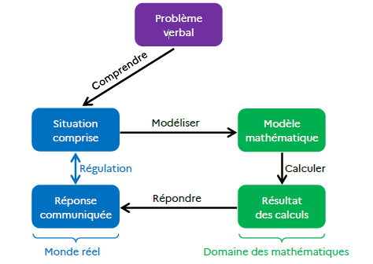

# Résolution de problèmes (C2 & C3)
Créer et mener une séance explicite — 180 min

Claire Fricaudet

---

## 🎯 Objectifs de la formation
- Trame explicite M→G→A→MC→I
- Démarche: lire→représenter→résoudre→vérifier
- Différenciation & accessibilité
- Alignement programmes 2025

---

## 🗺️ Plan (180 min)
1) Ouverture (10’)
2) Représentations (30’)
3) Trame explicite (15’)
4) Séance modèle C2 (35’)
5) Atelier conception (50’)
6) Feedback croisé (30’)
7) Synthèse (10’)

---

## 🔓 1) Ouverture (10’)
- Objectifs & attendus
- Programmes 2025: fil conducteur « problèmes »
- Contrat didactique

---

## 💬 2) Analyse des représentations (30’)
- Questionnaire: tendances
- « Qu’est-ce qu’un problème ? »
- Malentendus récurrents

---

## 📚 2bis) Connaissances didactiques — repères
- Structures: transformation / combinaison / comparaison
- Démarche: lire → représenter → résoudre → vérifier
- Représentations: barres, tableaux, ligne numérique

---

## 🧩 2ter) Connaissances didactiques — exemples
- Additifs C2: schéma en barres (parties‑tout)
- Multiplicatifs C3: tableau de valeurs

---

## 🧭 3) Trame explicite (15’)
- Modelage → Guidage → Autonomie → Mise en commun → Institutionnalisation
- Critères observables

---

## 🧑‍🏫 4) Séance modèle C2 (35’)
- Additifs: transformation / combinaison / comparaison
- Schémas en barres; phrase-réponse
- Déroulé: M → G → A → MC

---

# ☕ Pause (10’)

---

## ✏️ 5) Atelier conception (50’)
- Binômes: gabarit de séance
- Variantes différenciées / accessibilité

---

## 🔁 6) Feedback croisé (30’)
- Grille 0–3 par critère
- Feedback structuré (3 priorités)

---

## ✅ 7) Synthèse & ressources (10’)
- « À retenir »: démarches, structures, représentations
- Roadmap: dépôt, feedback IA, entraînements

---

## 📎 Références (internes)
- Polycopié 180’
- Séance modèle C2 / Cheat sheet / Grille
- Synthèses: CP, C3, Résolution v2, Annexes
